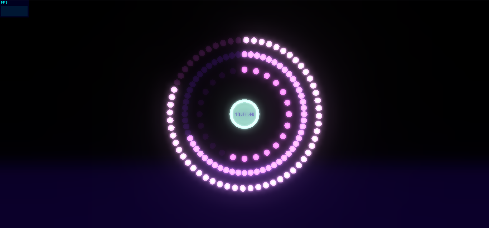
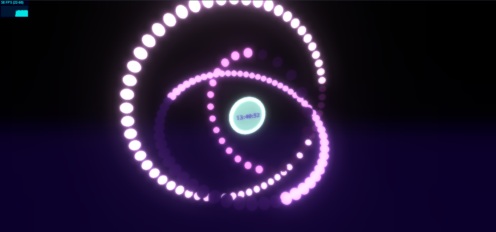

# Fancy Clock 3D
> Fancy 3D clock visualization.

## Table of contents
- [Fancy Clock 3D](#fancy-clock-3d)
  - [Table of contents](#table-of-contents)
  - [General info](#general-info)
  - [Demo](#demo)
  - [Screenshots](#screenshots)
  - [Technologies](#technologies)
  - [Setup and run](#setup-and-run)
  - [Features](#features)
  - [Issues](#issues)
  - [Status](#status)
  - [Contact](#contact)

## General info
Main goal of this project was to learn basics of WebGL programming using Three.js library, making it fun and gripping experience. In other words, I wanted not only to learn new technology, but also create nice looking visualization.

## Demo
Project is avaible online on Github Pages [here](https://michaltkacz.github.io/fancy-clock-3d/).

## Screenshots

## Technologies
* [Three.js](https://threejs.org/ "Three.js webpage") library (project developed under version: [r125](https://github.com/mrdoob/three.js/releases "Three.js version changelog")).
* [stats.js](https://github.com/mrdoob/stats.js/ "stats.js github page") library.

## Setup and run
To run it locally, just download repository and launch `index.html` on local server. Web browser must support WebGL. In case you don't know whether your browser supports WebGL or not, you can check it [here](https://get.webgl.org/).

## Features
List of features:
* Fancy clock visualization.
* Time display.
* Mouse interaction with camera.

To-do ideas:
* Adjust color palette.
* Add color pickers for each individual ring.
* Add controls to manage rings rotations.
* Add camera auto rotation.

## Issues
No major issues are known. However, there might be minor performance drops on lower-spec computers.

## Status
Altough there are interesting features that might be added, this project is no longer developed.

## Contact
Created by [@michaltkacz](https://github.com/michaltkacz) - feel free to contact me!